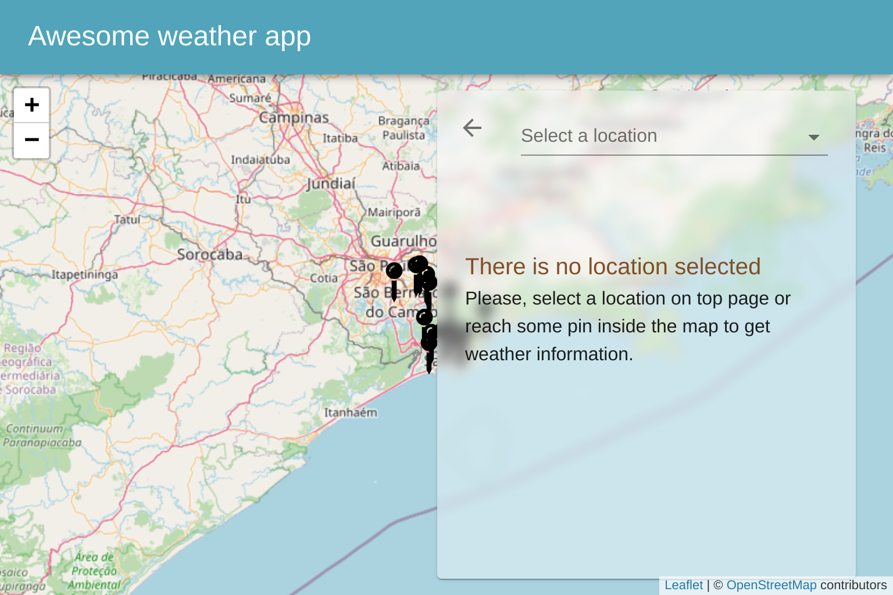

# Awesome Weather

Hi There [:grinning:],

I bootstrapped this project with [Create React App](https://github.com/facebook/create-react-app).

I also used some tools to solved that challenge, such as:

- [Material UI](https://material-ui.com/) : Well documented UI tool, that helps to develop layout and some components quickly;

- [Axios](https://axios-http.com/) : An Ajax tool helps develop services rules easily;

- [Leaflet](https://leafletjs.com/) : A Map service that allows to render a map on the screen with few lines of code. The map events can control some states into the application;

- [React Router](https://reactrouter.com/) : To help users navigate through the application's pages;

- [Eslint](https://eslint.org/) and [Prettier](https://prettier.io/) : That helps to write a legible code;

- [husky](https://www.husky.io/) and [lint-staged](https://opencollective.com/lint-staged) : To check and fix any linting error before commit code into the repository;

- [git-commit-msg-linter](https://github.com/legend80s/commit-msg-linter#readme) : This tool helps to keep a standard of commit writing into repository.

## Screenshots

### Home

### Home Mobile

### Weather Info

### Weather Mobile

You also can check the application running [Here](https://awesome-weather-react-app.netlify.app).

### Running in DEV

To running this application in your system, [NodeJs](https://nodejs.org/en/) is needed. Follow de steps below:

- Once NodeJs intalled, you need to clone this repo with following command: `git clone https://github.com/WLCPereira/awesome-weather-app.git`;

- Then access de page into terminal: `cd /awesome-weather-app`;

- Run `npm install` or `yarn install` to instal all projec dependecies;

- Run `npm start` or `yarn start`;

          IMPORTANT

  To the application work fine, you need to fill the REACT_APP_OPENWEATHER_TOKEN variable into .env file. To get the value to fill that field, access this [link](https://home.openweathermap.org/users/sign_up)

I hope you all enjoy that. =)

Bye!
